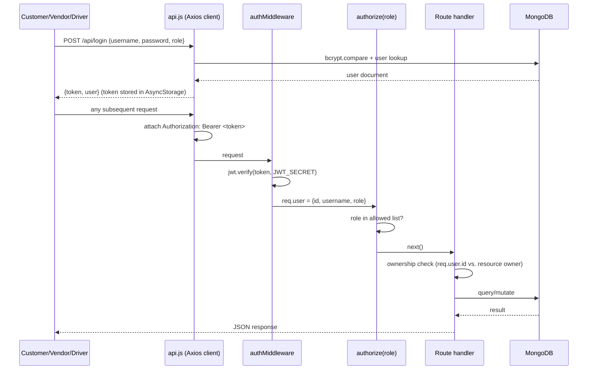
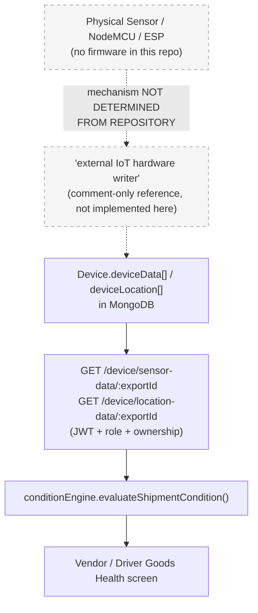
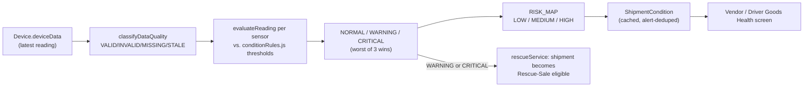
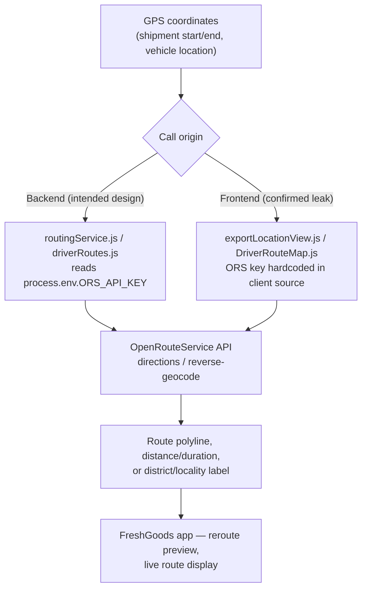

# FreshGoods — Complete API, Authentication & Security Report

**Scope:** Full read-only audit of the FreshGoods repository (`server/` Express backend + `FreshGoods/` React Native/Expo app).
**Method:** Direct code inspection (routes, services, models, middleware, config, frontend API client, env files).
**Change policy:** Audit only. No file was created, renamed, deleted, or modified while producing this report.
**Date:** 2026-08-20

---

## 1. Executive Summary

FreshGoods is an Express 5 + MongoDB (Mongoose) backend serving a React Native/Expo mobile app with three roles: **Vendor**, **Driver**, **Customer**. Authentication is JWT-based (`jsonwebtoken`, `Authorization: Bearer <token>`), passwords are hashed with `bcryptjs` via Mongoose `pre('save')` hooks, and role/ownership checks are enforced in middleware plus hand-written per-handler comparisons against `req.user.id`.

**Route count:** 90 endpoints total across 10 route files + 1 health check in `server.js`. One route file (`dashboardRoutes.js`) is empty and not mounted — dead code, zero attack surface.

**Auth posture:** Only 6 endpoints are public: `GET /health`, `POST /api/signup`, `POST /api/login`, `POST /api/forgot-password`, `POST /api/verify-otp`, `POST /api/reset-password`. Every other endpoint requires a valid JWT; most additionally require a specific role, and almost all resource-level handlers additionally verify the requester owns the resource (comparing the JWT's `req.user.id` — never a client-supplied id — against the document's owner field).

**The single most important finding for this audit:** the `Device` model (`server/models/deviceModel.js`) has a `deviceData[]` array (temperature/humidity/ethyleneLevel readings) and a `deviceLocation[]` array (GPS pings) that are **read** by 5 API endpoints and 2 backend services — but **no endpoint, service, script, or any other code path anywhere in this repository writes to either array.** The physical sensor → backend ingestion API that the "Goods Health" feature depends on **does not exist in this codebase**. Code comments in `deviceModel.js` refer to "the external IoT hardware writer" as the thing that populates this data, implying that writer is a separate system/firmware/script not included in this repo, or has not been built yet. See Section 6 and Section 18 for full detail.

**Second most important finding:** the OpenRouteService (ORS) API key, which `server/.env`'s own comment says must **never be exposed to the mobile app**, is hardcoded as a literal string in two frontend files (`exportLocationView.js`, `DriverRouteMap.js`), which call ORS directly from the client. This key ships inside the app bundle and is committed to git history (unlike `server/.env`, which is correctly gitignored). See Section 11 and Section 17.

**Other findings** (all lower severity, detailed in Section 17): user-enumeration on the password-reset flow, OTP written to the server console log, OTP/reset-token state kept in a non-persistent in-memory `Map`, a hardcoded bulk-reset password in a one-off maintenance script, a substring (not exact) match in the Pusher chat channel-auth check, and one chat endpoint (`GET /chat/vendors/get`) reachable by any authenticated role rather than being scoped.

Nothing in the repository was modified to produce this report.

---

## 2. Complete API Inventory

### 2.0 Mounting order (`server/server.js`)

```
GET  /health                                                       PUBLIC
app.use('/api',          signupRoute)                              PUBLIC
app.use('/api',          loginRoute)                                PUBLIC
app.use('/api',          passwordReset routes)                      PUBLIC
app.use('/api/vendor',   authMiddleware, serviceRequestRoutes)      JWT (+ per-route role)
app.use('/api/vendor',   authMiddleware, vendorRoutes)               JWT + role Vendor (blanket)
app.use('/api/driver',   authMiddleware, authorize('Driver'),   driverRoutes)
app.use('/api/customer', authMiddleware, authorize('Customer'), customerRoutes)
app.use('/chat',         authMiddleware, chat routes)                JWT (+ per-route role, 2 of 7 routes)
app.use('/api/user',     authMiddleware, user routes)                JWT, any role
```

`serviceRequestRoutes.js` and `vendorRoutes.js` share the `/api/vendor` prefix. Order matters: `serviceRequestRoutes` is mounted first and handles its own paths (including a Customer-only create endpoint) via its own per-route `authorize()` calls; anything it doesn't recognize falls through to `vendorRoutes`, which applies a blanket `router.use(authorize('Vendor'))` at line 23 to everything in that file.

`dashboardRoutes.js` is **0 bytes and not referenced anywhere in `server.js`** — confirmed dead code.

### 2.1 Public / Unauthenticated APIs

| Method | Path | File:Line | Purpose | Request body | Response |
|---|---|---|---|---|---|
| GET | `/health` | server.js:19 | Liveness check | — | `{success, status:'ok', uptime}` |
| POST | `/api/signup` | signupRoute.js:13 | Self-registration, **Vendor or Customer only** — `role==='Driver'` explicitly rejected (403); Drivers can only be created by a Vendor via `POST /api/vendor/drivers` | role, name, username, email, mobile, password, businessName?, state, district | `{success, message, user}` (409 on duplicate username/email, incl. E11000 fallback) |
| POST | `/api/login` | loginRoute.js:11 | Login for any role | username, password, role | `{success, message, user, token}` — see Section 5 for JWT detail |
| POST | `/api/forgot-password` | passwordReset.js:40 | Request a 6-digit OTP | email, role | `{success, message, devOtp?}` (`devOtp` only when `NODE_ENV==='development'`) |
| POST | `/api/verify-otp` | passwordReset.js:96 | Verify OTP, issue a reset token | email, otp | `{success, message, resetToken}` |
| POST | `/api/reset-password` | passwordReset.js:166 | Set new password using the reset token | email, resetToken, newPassword | `{success, message}` |

### 2.2 Vendor APIs — `server/routes/vendorRoutes.js` (mounted `/api/vendor`, 39 routes)

Blanket gate: JWT (mount) + `authorize('Vendor')` at line 23 — applies to **every** route below, no exceptions.

| # | Method + Path | Line | Purpose | Ownership check | Request params/body | Models | External calls |
|---|---|---|---|---|---|---|---|
| 1 | GET `/all` | 35 | List vendor's drivers | `Vendor.findById(req.user.id)` | — | Vendor, Driver | — |
| 2 | POST `/drivers` | 54 | Create a Driver account under this vendor | creation, `vendor: req.user.id` | name, username, email, mobile, password, licenseNo, state, district | Driver, Vendor | — |
| 3 | POST `/remove-driver` | 112 | Detach a driver | `vendor.drivers.some(id===driverId)` | driverId | Vendor, Driver | — |
| 4 | GET `/vehicles` | 143 | List vendor's vehicles | `vendorId(query)!==req.user.id`→403 | vendorId (query, optional) | Vendor, Vehicle | — |
| 5 | GET `/devices` | 169 | List vendor's devices | scoped `vendor: req.user.id` | — | Device | — |
| 6 | GET `/available-devices` | 183 | List unassigned devices | scoped `vendor: req.user.id` | — | Device | — |
| 7 | POST `/register-device` | 196 | Register a new Device | creation, `vendor: req.user.id` | deviceName | Device | — |
| 8 | POST `/assign-device` | 222 | Attach device to owned vehicle | `vehicle.vendor!==req.user.id`; device re-queried scoped to vendor | vehicleId, deviceName | Vehicle, Device | — |
| 9 | POST `/unassign-device` | 259 | Detach device from vehicle | `vehicle.vendor!==req.user.id` | vehicleId | Vehicle, Device | — |
| 10 | POST `/add-vehicle` | 296 | Create a vehicle (+ optional device) | `vendorId(body)!==req.user.id`; device scoped to vendor | _id, vehicleNumber, brand, capacity, deviceId, vendorId | Vehicle, Vendor, Device | — |
| 11 | POST `/assign-driver-vehicle` | 346 | Standing driver↔vehicle assignment | driver/vehicle checked against vendor's own lists | driverId, vehicleId | Vendor, Driver, Vehicle | — |
| 12 | POST `/unassign-driver-vehicle` | 391 | Clear driver↔vehicle assignment | checked against vendor's own driver list | driverId | Vendor, Driver, Vehicle | — |
| 13 | GET `/exports` | 430 | List vendor's exports (query form) | `vendorId(query)!==req.user.id` | vendorId (query, required) | Export | — |
| 14 | GET `/availableResources` | 453 | Free drivers/vehicles in a date range | `vendorId(query)!==req.user.id` | vendorId, startDate, endDate | Vendor, Export, Driver, Vehicle | — |
| 15 | POST `/export/add/:vendorId` | 505 | Create a shipment/export | `vendorId(param)!==req.user.id`; driver/vehicle re-checked against vendor's own lists | itemName, startDate, endDate, quantity, costPrice, salePrice, driver, vehicle, salary, startLocation, endLocation, +optional | Export, Vendor, Customer, Vehicle, Device, Driver | notificationService, logShipmentEvent |
| 16 | GET `/export/:id` | 656 | Single export detail | `exportData.vendorId!==req.user.id` | id | Export | — |
| 17 | PUT `/export/:id` | 681 | Update export status | `existing.vendorId!==req.user.id` | status | Export | shipmentStateMachine, logShipmentEvent |
| 18 | DELETE `/export/:id` | 719 | Delete export (only if in a deletable status) | `exportData.vendorId!==req.user.id` | id | Export, Driver | — |
| 19 | GET `/export/passedstatus/:vendorId` | 773 | List IN_TRANSIT exports | `vendorId(param)!==req.user.id` | vendorId | Export | — |
| 20 | **GET `/device/sensor-data/:exportId`** | 800 | Raw sensor readings for an export's device | `exp.vendorId!==req.user.id` | exportId; date/startDate/endDate (query) | Export, Vehicle, Device | — (**read-only, see §6**) |
| 21 | **GET `/device/location-data/:exportId`** | 852 | Raw GPS pings for an export's device | `exp.vendorId!==req.user.id` | exportId | Export, Vehicle, Device | — (**read-only, see §6**) |
| 22 | GET `/device/condition/:exportId` | 881 | Calculated goods-health/condition | `exp.vendorId!==req.user.id` | exportId | Export | **conditionEngine.evaluateShipmentCondition** |
| 23 | POST `/export/intermediateLocation/push/:export_id` | 911 | Push one GPS point onto the shipment's route trail (`Export.intermediateLocations`, **not** the Device model) | `existing.vendorId!==req.user.id` | latitude, longitude | Export | — |
| 24 | GET `/export/intermediateLocation/get/:exportId` | 949 | Read shipment's GPS trail | `exp.vendorId!==req.user.id` | exportId | Export | — |
| 25 | GET `/exports/:vendorId` | 970 | List vendor's exports (path form, duplicate of #13) | `vendorId(param)!==req.user.id` | vendorId | Export | — |
| 26 | PUT `/export/start/:exportId` | 992 | Vendor starts export | `exp.vendorId!==req.user.id` | exportId | Export | notificationService, notifyEligibleCustomers, logShipmentEvent |
| 27 | PUT `/export/complete/:exportId` | 1027 | Vendor completes export | `exp.vendorId!==req.user.id` | exportId | Export | notificationService, notifyEligibleCustomers, logShipmentEvent |
| 28 | GET `/export/:id/events` | 1062 | Shipment event timeline (vendor view) | `exp.vendorId!==req.user.id` | id | Export, ShipmentEvent | — |
| 29 | PUT `/export/:id/tracking-permissions` | 1082 | Grant/revoke which customers can track a shipment | `exp.vendorId!==req.user.id` | viewers: [{customerId, allowed}] | Export, Customer | — |
| 30 | POST `/rescue-sales` | 1140 | Create+publish a rescue sale for an at-risk shipment | delegated to rescueService (`req.user.id`) | shipmentId + payload | RescueSale | **rescueService** (gates on conditionEngine WARNING/CRITICAL) |
| 31 | GET `/rescue-sales` | 1153 | List vendor's rescue sales | delegated | — | RescueSale | rescueService |
| 32 | GET `/rescue-sales/:id` | 1163 | Single rescue sale | delegated | id | RescueSale | rescueService |
| 33 | PUT `/rescue-sales/:id` | 1173 | Edit commercial terms | delegated | id + body | RescueSale | rescueService |
| 34 | POST `/rescue-sales/:id/cancel` | 1183 | Cancel a rescue sale | delegated | id | RescueSale | rescueService, rerouteService |
| 35 | GET `/rescue-sales/:id/interested-buyers` | 1201 | List interested buyers | delegated | id | RescueSale, RescueInterest | rescueService |
| 36 | POST `/rescue-sales/:id/select-buyer` | 1212 | Select winning buyer | delegated | id, customerId | RescueSale | rescueService |
| 37 | POST `/rescue-sales/:id/route-preview` | 1241 | Stateless reroute preview | delegated | id | (not persisted) | rerouteService → **routingService (ORS)** |
| 38 | POST `/rescue-sales/:id/confirm-reroute` | 1252 | Confirm reroute | delegated | id | RerouteRequest | rerouteService → **routingService (ORS)** |
| 39 | GET `/rescue-sales/:id/reroute` | 1262 | Fetch current reroute | delegated | id | RerouteRequest | rerouteService |

### 2.3 Driver APIs — `server/routes/driverRoutes.js` (mounted `/api/driver`, 14 routes)

Gate: JWT (mount) + `authorize('Driver')` (mount) — applies to all 14 routes; no per-route role middleware, ownership is hand-checked in every handler.

| # | Method + Path | Line | Purpose | Ownership check | Params/Body | Models | External calls |
|---|---|---|---|---|---|---|---|
| 1 | GET `/export/driver/:driverId` | 17 | Driver's own job list | `driverId(param)!==req.user.id` | driverId | Export | — |
| 2 | GET `/profile/:driverId` | 37 | Driver profile (password stripped) | `driverId(param)!==req.user.id` | driverId | Driver | — |
| 3 | PUT `/export/start/:id` | 179 | Driver starts export | `exp.driver!==req.user.id` | id | Export, Vendor | **ORS directions + reverse-geocode (`getDistrictsBetween`, inline in this file) + Nominatim fallback**; notificationService, notifyEligibleCustomers |
| 4 | PUT `/export/accept/:id` | 228 | Driver accepts assignment | `exp.driver!==req.user.id` | id | Export, Vendor | notificationService |
| 5 | PUT `/export/reject/:id` | 269 | Driver rejects assignment | `exp.driver!==req.user.id` | reason, id | Export | notificationService |
| 6 | PUT `/export/complete/:id` | 323 | Driver completes export | `exp.driver!==req.user.id` | id | Export, Vendor | notificationService, notifyEligibleCustomers, rerouteService.completeActiveReroute |
| 7 | **GET `/device/sensor-data/:exportId`** | 378 | Raw sensor readings | `exp.driver!==req.user.id` | exportId; date/startDate/endDate | Export, Vehicle, Device | — (**read-only, see §6**) |
| 8 | **GET `/device/location-data/:exportId`** | 432 | Raw GPS pings | `exp.driver!==req.user.id` | exportId | Export, Vehicle, Device | — (**read-only, see §6**) |
| 9 | GET `/device/condition/:exportId` | 463 | Calculated condition (driver-trimmed response) | `exp.driver!==req.user.id` | exportId | Export | **conditionEngine.evaluateShipmentCondition** |
| 10 | GET `/map/export/:id` | 489 | Full export doc for map screen | `exp.driver!==req.user.id` | id | Export | — |
| 11 | GET `/export/:id/events` | 504 | Shipment event timeline (driver view) | `exp.driver!==req.user.id` | id | Export, ShipmentEvent | — |
| 12 | GET `/export/:exportId/reroute` | 537 | Fetch reroute | delegated to rerouteService | exportId | RerouteRequest | rerouteService |
| 13 | POST `/export/:exportId/reroute/acknowledge` | 547 | Acknowledge reroute | delegated | exportId | RerouteRequest | rerouteService |
| 14 | POST `/export/:exportId/reroute/report-issue` | 557 | Report an issue on a reroute | delegated | reason, exportId | RerouteRequest | rerouteService |

**Note:** the ORS/Nominatim calls used by route #3 (`getDistrictsBetween`/`reverseGeocode`, lines 74–173 of this file) run synchronously inside the request handler — that endpoint's latency is coupled to two third-party services.

### 2.4 Customer APIs — `server/routes/customerRoutes.js` (mounted `/api/customer`, 15 routes)

Gate: JWT (mount) + `authorize('Customer')` (mount) — all 15 routes.

| # | Method + Path | Line | Purpose | Ownership check | Params/Body | Models |
|---|---|---|---|---|---|---|
| 1 | GET `/profile/:customerId` | 34 | Customer profile (password stripped) | `customerId(param)!==req.user.id` | customerId | Customer |
| 2 | PUT `/location` | 60 | Set preferred delivery location | always `req.user.id` | latitude, longitude | Customer |
| 3 | GET `/vendors` | 102 | Browse all vendors | none — public directory by design | — | Vendor |
| 4 | GET `/vendors/:vendorId` | 118 | Single vendor detail | none — by design | vendorId | Vendor |
| 5 | GET `/exports/available` | 139 | Browse IN_TRANSIT shipments (via `toCustomerView()`, strips price/salary/instructions) | none — public browse | state, district | Export |
| 6 | GET `/my-shipments` | 176 | Shipments where customer is named or granted tracking | scoped to `customer: req.user.id` or `trackingViewers` | — | Export |
| 7 | GET `/track/:exportId` | 206 | Live tracking info | `exportData.canCustomerTrack(req.user.id)` | exportId | Export |
| 8 | GET `/track/:exportId/events` | 251 | Filtered event timeline (no rejection reasons/actor identity) | `canCustomerTrack` | exportId | Export, ShipmentEvent |
| 9 | **GET `/track/:exportId/location`** | 284 | Live device location | `canCustomerTrack` | exportId | Export, Vehicle, Device (**read-only, see §6**) |
| 10 | GET `/dashboard/:customerId` | 313 | Dashboard stats | `customerId(param)!==req.user.id` | customerId | Customer, Export, Vendor |
| 11 | PUT `/rescue-preferences` | 378 | Opt-in/out of rescue-sale alerts + location | always `req.user.id` | optIn, latitude, longitude | Customer |
| 12 | GET `/rescue-sales` | 392 | Nearby eligible rescue sales | delegated | — | RescueSale |
| 13 | GET `/rescue-sales/:id` | 402 | Single rescue sale | delegated | id | RescueSale |
| 14 | POST `/rescue-sales/:id/interest` | 412 | Express interest | always `req.user.id` | id | RescueInterest |
| 15 | DELETE `/rescue-sales/:id/interest` | 422 | Withdraw interest | always `req.user.id` | id | RescueInterest |

### 2.5 Chat APIs — `server/routes/chat.js` (mounted `/chat`, 7 routes)

Gate: JWT (mount), any role — 2 of 7 routes add their own role check.

| # | Method + Path | Line | Extra auth | Ownership/authz | Body/Params | Models | External |
|---|---|---|---|---|---|---|---|
| 1 | POST `/chat/pusher/auth` | 42 | any role | `channel_name.includes(userId)` — **substring match, not structural** (flagged §17) | socket_id, channel_name | — | Pusher (channel auth) |
| 2 | POST `/chat/send` | 62 | any role | sender must be one of `[vendorId,customerId,driverId]` | vendorId, customerId?, driverId?, content | Message, Vendor, Customer, Driver | Pusher.trigger, Expo push, notificationService |
| 3 | GET `/chat/history` | 136 | any role | requester must be one of `[vendorId,targetId]` | vendorId, targetId, chatType | Message | — |
| 4 | GET `/chat/vendors/get` | 159 | **any role, no extra gate** (flagged §17) | none | q (optional) | Vendor | — |
| 5 | GET `/chat/customers/get` | 186 | **`authorize('Vendor')`** | vendor-only by role | — | Customer | — |
| 6 | GET `/chat/vendor-drivers` | 196 | any role | `vendorId(query)!==req.user.id` | vendorId | Vendor | — |
| 7 | GET `/chat/vendors/by-driver` | 222 | any role | `driverId(query)!==req.user.id` | driverId | Vendor | — |

### 2.6 Service Request APIs — `server/routes/serviceRequestRoutes.js` (mounted `/api/vendor`, 5 routes)

Every route carries its own explicit `authorize()` call rather than relying on a blanket gate — this is what lets a **Customer** JWT reach a path under the `/api/vendor` prefix.

| # | Method + Path | Line | Role | Ownership | Params/Body | Model |
|---|---|---|---|---|---|---|
| 1 | GET `/api/vendor/service-requests/:vendorId` | 15 | Vendor | `vendorId(param)!==req.user.id` | vendorId | ServiceRequest |
| 2 | POST `/api/vendor/service-requests` | 38 | **Customer** | creation, `customer: req.user.id` | vendorId, serviceType, message | ServiceRequest |
| 3 | PUT `/api/vendor/service-requests/:requestId/accept` | 74 | Vendor | `existing.vendor!==req.user.id` | requestId | ServiceRequest |
| 4 | PUT `/api/vendor/service-requests/:requestId/reject` | 106 | Vendor | `existing.vendor!==req.user.id` | requestId, reason | ServiceRequest |
| 5 | PUT `/api/vendor/service-requests/:requestId/complete` | 140 | Vendor | `existing.vendor!==req.user.id` | requestId, response | ServiceRequest |

### 2.7 User APIs — `server/routes/user.js` (mounted `/api/user`, 4 routes)

Gate: JWT only, any role.

| # | Method + Path | Line | Purpose | Ownership | Params/Body | Model |
|---|---|---|---|---|---|---|
| 1 | POST `/api/user/token` | 8 | Save Expo push token | `userId!==req.user.id` | userId, pushToken | Vendor/Customer/Driver |
| 2 | GET `/api/user/notifications` | 42 | List own notifications | scoped `recipient: req.user.id` | — | Notification |
| 3 | PUT `/api/user/notifications/:id/read` | 62 | Mark one read | `recipient!==req.user.id \|\| recipientModel!==req.user.role` | id | Notification |
| 4 | PUT `/api/user/notifications/read-all` | 86 | Mark all own read | scoped update filter | — | Notification |

---

## 3. Authentication & Protection

### 3.1 Protection classification

| Classification | Endpoints |
|---|---|
| PUBLIC / NO AUTH | `/health`, `/api/signup`, `/api/login`, `/api/forgot-password`, `/api/verify-otp`, `/api/reset-password` |
| PASSWORD-BASED (credential in the request itself) | `/api/login` (username+password+role), `/api/reset-password` (email+resetToken+newPassword) |
| JWT PROTECTED | All `/chat/*` (except role add-on), `/api/user/*` |
| JWT + ROLE PROTECTED | All `/api/driver/*`, all `/api/customer/*`, all `/api/vendor/*` (vendorRoutes.js blanket), `serviceRequestRoutes.js` (per-route role) |
| JWT + OWNERSHIP PROTECTED | Nearly every resource-scoped handler across vendor/driver/customer/chat/user routes — see the "Ownership check" column in Section 2 |
| DEVICE AUTHENTICATED | **None found.** No endpoint in this repo authenticates a physical device (see Section 6/7) |
| API-KEY PROTECTED | **None** — no route in `server/routes/*.js` is gated by an API key. (ORS/Nominatim are outbound calls the backend makes *as a client*, not inbound protection — see Section 9–11) |
| EXTERNAL API | OpenRouteService, Nominatim, Pusher, Expo Push — all called *from* FreshGoods, not calling *into* it |

### 3.2 The auth chain

```
Login (POST /api/login)
   ↓  bcrypt.compare(password, user.password)
JWT generated — jwt.sign({id, username, role}, JWT_SECRET, {expiresIn:'7d'})
   ↓
Mobile app stores token in AsyncStorage (key: "token")
   ↓
api.js request interceptor reads AsyncStorage → sets header
   ↓
Authorization: Bearer <JWT>
   ↓
authMiddleware (server/middleware/auth.js)
   - missing/malformed header → 401 "Access denied. No token provided."
   - jwt.verify(token, process.env.JWT_SECRET)
   - TokenExpiredError → 401 "Token expired. Please login again."
   - JsonWebTokenError → 401 "Invalid token."
   - JWT_SECRET unset server-side → 500 "Server configuration error"
   - success → req.user = {id, username, role} (from JWT payload only)
   ↓
authorize(...roles) [where used] — req.user.role not in allowed list → 403
   ↓
Route handler — hand-written ownership check, e.g. `if (doc.vendorId.toString() !== req.user.id) return res.status(403)...`
   ↓
Mongoose model access
```

Every ownership check found across all reviewed route files sources the trusted identity from `req.user.id` (the verified JWT payload) — never from a client-supplied body/query/param value used as the trust anchor. This pattern held with no exceptions in the full read of all 10 route files.

### 3.3 Failure behavior summary

| Failure | HTTP status | Message pattern |
|---|---|---|
| No/malformed Authorization header | 401 | "Access denied. No token provided." |
| Expired JWT | 401 | "Token expired. Please login again." |
| Invalid/tampered JWT | 401 | "Invalid token." |
| `JWT_SECRET` missing server-side | 500 | "Server configuration error" |
| Role not permitted (`authorize`) | 403 | "Access denied. Required role: X" |
| Ownership check fails | 403 | Handler-specific, e.g. "Access denied. Not your export." |

---

## 4. Password Authentication

**A. APIs where a user sends a password directly:**
- `POST /api/signup` — password in body, hashed on save.
- `POST /api/login` — password compared via bcrypt.
- `POST /api/reset-password` — newPassword in body, hashed on save.
- `POST /api/vendor/drivers` — vendor sets an initial password for a new Driver account (hashed on save).

**B. APIs protected by a JWT obtained after login:** every endpoint in Sections 2.2–2.7 (all of `/api/vendor`, `/api/driver`, `/api/customer`, `/chat`, `/api/user`).

**C. APIs protected directly by an API key:** none found.

**D. APIs requiring no authentication:** the 6 public endpoints listed in 2.1.

**Hashing mechanism:** `customerModel.js`, `driverModel.js`, and `vendorModel.js` each define an identical pattern — a `password: String` field, a Mongoose `pre('save')` hook guarded by `if (!this.isModified('password')) return next();`, which calls `bcrypt.genSalt(10)` then `bcrypt.hash()` (via the `bcryptjs` package — pure-JS bcrypt, functionally equivalent to native `bcrypt`). Passwords are **never** stored or compared in plaintext. All three models also override `toJSON()` to `delete obj.password` before serialization, so a fetched user document never leaks its hash in an API response — confirmed as a retrofit applied consistently across all three roles.

`passwordReset.js`'s reset flow deliberately calls `user.password = newPassword; await user.save()` rather than `findByIdAndUpdate(...)`, specifically so the `pre('save')` hash hook still runs (a `findByIdAndUpdate` call would bypass Mongoose middleware and write the new password in plaintext) — this is a correct, deliberately-commented design choice in the code.

The one-off script `server/scripts/migratePasswords.js` hardcodes a bulk reset password as a source constant, which it hashes via bcrypt before writing to every Vendor/Driver/Customer record — see Section 17.

---

## 5. JWT Authentication

- **Generated at:** `server/routes/loginRoute.js:46-50`.
- **Login endpoint:** `POST /api/login`.
- **Payload fields:** `{ id: user._id, username: user.username, role }` — role comes from the request body (validated against the user found by username), not re-derived from the DB record independently of the lookup.
- **Signing secret:** `process.env.JWT_SECRET`, read from `server/.env` (present, gitignored). The middleware fails closed (500, not a silent bypass) if this variable is unset.
- **Expiration:** `expiresIn: '7d'`.
- **Verification middleware:** `authMiddleware` in `server/middleware/auth.js` (`jwt.verify`), applied at every protected mount point in `server.js`.
- **Roles carried:** `Vendor`, `Driver`, `Customer` — no `Admin`/other role exists in the codebase.
- **Access restriction by role:** enforced two ways — router-mount-level `authorize('Driver')`/`authorize('Customer')` for those two role's entire route trees, and an in-file blanket `router.use(authorize('Vendor'))` for `vendorRoutes.js`. `serviceRequestRoutes.js` and `chat.js` instead apply `authorize()` per individual route.
- **Ownership checked after JWT auth?** Yes, extensively — see the ownership column throughout Section 2. Role alone is not treated as sufficient; nearly every handler additionally confirms the specific resource belongs to the authenticated user.
- **Note on the login response:** `POST /api/login` returns `{ success, message, user, token }`, i.e., the full Mongoose user document. Because all three user models' `toJSON()` strips `password` before serialization (see Section 4), this does not leak the password hash — but it is worth noting the response includes the entire profile document rather than a minimal claim set.

Per the task's instructions, the actual JWT secret value is not printed anywhere in this report. Qualitatively: it is a short, human-readable literal string rather than a long, high-entropy random value — see Section 17 for the associated recommendation.

---

## 6. IoT/Sensor API Flow — the core question of this audit

### 6.1 The intended flow (per the Device schema and its comments)

```
Physical sensor / NodeMCU / ESP  (no firmware/code for this exists anywhere in this repository)
        ↓  (mechanism NOT DETERMINED FROM REPOSITORY)
"the external IoT hardware writer"   ← literal phrase from deviceModel.js comments
        ↓
Device.deviceData[] / Device.deviceLocation[]   (MongoDB, written directly — no Express route involved)
        ↓
GET /api/vendor/device/sensor-data/:exportId, /device/location-data/:exportId
GET /api/driver/device/sensor-data/:exportId,  /device/location-data/:exportId
GET /api/customer/track/:exportId/location
        ↓  (JWT + role + ownership on all of the above)
conditionEngine.evaluateShipmentCondition()  (reads the latest deviceData reading)
        ↓
Goods Health screen (Vendor & Driver apps)
```

### 6.2 What was actually verified in the codebase

A repository-wide search (routes, services, models, migration scripts) for every write-shaped operation against the `Device` model was performed independently by two research passes plus a direct grep of `server/` for `Device.find|new Device(|Device.update|deviceData\s*[.:=]|deviceLocation\s*[.:=]|\$push`. Results:

- `new Device({...})` — only in `POST /api/vendor/register-device` (vendorRoutes.js:204), which creates a device with the schema's **empty defaults** for `deviceData`/`deviceLocation` (`default: []`). It does not populate sensor readings.
- The only two `$push` operations found anywhere in `server/routes/` push into `Driver.work` (vendorRoutes.js:617, a job-assignment record) and `Export.intermediateLocations` (vendorRoutes.js:931, a manually-triggered vendor GPS-trail endpoint) — **neither touches the `Device` model.**
- Every other reference to `Device.deviceData` or `Device.deviceLocation` across the entire `server/` tree (routes, services, models, migration scripts) is a **read**: `Device.findOne(...)`, `device?.deviceData || []`, `device?.deviceLocation || []`.

**Conclusion: there is no ingestion endpoint, service function, or script in this repository that writes sensor readings or GPS pings into the `Device` model.** The comment in `deviceModel.js` — *"deviceName remains the sole join key the external IoT hardware writer and the telemetry read routes use"* — describes an integration point, not an implementation: it tells you the **join key** (`deviceName`, a unique string on the Device document) that an external writer is expected to use, but that external writer's code is not part of this repository. This could mean: (a) it is a separate service/firmware/script maintained outside this repo, (b) data is inserted directly into MongoDB (e.g., manually, via a script not checked into this repo, or via a database GUI/seed process), or (c) the ingestion side has not been built yet and the Device documents currently in the database were seeded by hand. **Which of these is true cannot be determined from this repository — NOT DETERMINED FROM REPOSITORY.**

### 6.3 Sensor → Backend (the ingestion side, if/when it exists)

| Question | Answer |
|---|---|
| Which endpoint receives sensor data? | **None exists in this repository.** |
| HTTP method? | N/A |
| Request body shape? | N/A — though the target schema is known: `{ humidity: Number, temperature: Number, ethyleneLevel: Number, timestamp: Date }` per `sensorDataSchema` in `deviceModel.js` |
| Required headers? | N/A |
| Device ID used for matching? | The schema's intended join key is `Device.deviceName` (a unique string), matched against `Vehicle.deviceId` |
| API key / password / JWT / token / secret? | None exists to describe — there is no endpoint to protect |
| IP restriction / other protection? | None found — no such endpoint exists to restrict |

**Per the audit brief's own instruction, stated explicitly:** *"Sensor ingestion endpoint appears to be unauthenticated"* would be the finding **if an ingestion endpoint existed with no auth on it** — but the more precise and accurate finding here is stronger: **no sensor ingestion endpoint exists at all in this codebase**, authenticated or not.

### 6.4 Read side — confirmed endpoints, all authenticated

| Endpoint | Auth | Ownership | Data source |
|---|---|---|---|
| `GET /api/vendor/device/sensor-data/:exportId` | JWT + role Vendor | export's `vendorId === req.user.id` | `Device.deviceData[]` (raw) |
| `GET /api/driver/device/sensor-data/:exportId` | JWT + role Driver | export's `driver === req.user.id` | `Device.deviceData[]` (raw) |
| `GET /api/vendor/device/location-data/:exportId` | JWT + role Vendor | export's `vendorId === req.user.id` | `Device.deviceLocation[]` (raw) |
| `GET /api/driver/device/location-data/:exportId` | JWT + role Driver | export's `driver === req.user.id` | `Device.deviceLocation[]` (raw) |
| `GET /api/customer/track/:exportId/location` | JWT + role Customer | `Export.canCustomerTrack(req.user.id)` (explicit per-customer grant list) | `Device.deviceLocation[]` (last element only) |
| `GET /api/vendor/device/condition/:exportId`, `GET /api/driver/device/condition/:exportId` | JWT + role, ownership as above | — | **Calculated** — conditionEngine reads `Device.deviceData[]` internally, not exposed raw here |

All five raw-data endpoints and both condition endpoints are protected identically to every other resource endpoint in the app: JWT + role + explicit per-request ownership check. No device-specific credential is involved on the read side either — only the standard end-user JWT.

---

## 7. Sensor Data Retrieval APIs

Covered in full in Section 6.4. Summary of the device → vehicle → shipment relationship:

```
Device (deviceName, unique)
   ↕ join on Device.deviceName === Vehicle.deviceId
Vehicle (_id: Number — NOT a Mongoose ObjectId, a pre-existing design choice every Device/Driver/Vendor/Export ref to Vehicle matches)
   ↕ Export.vehicle (Number ref)
Export ("Shipment" model — collection is literally named "Export" in MongoDB; the model export name is `Shipment` in shipmentModel.js, mapped via `collection: 'Export'`)
```

A shipment's device is resolved indirectly at read time: `Export.vehicle` → `Vehicle.deviceId` → `Device.findOne({deviceName: vehicle.deviceId})`. There is no direct `Export.device` foreign key used for the read routes (though `shipmentModel.js` does carry a convenience `device` ObjectId ref, populated at creation time, that some listing endpoints use for display purposes only — the sensor-data/location-data/condition endpoints all re-resolve through `Vehicle.deviceId` rather than trusting that cached ref).

**Raw vs. calculated, explicitly distinguished per endpoint:**
- `device/sensor-data`, `device/location-data`, `track/:exportId/location` → **raw sensor/GPS data**, straight from `Device.deviceData[]`/`deviceLocation[]`.
- `device/condition` → **calculated** — output of `conditionEngine.evaluateShipmentCondition()`, never raw readings.

---

## 8. Goods Health / Condition APIs

```
Sensor data (Device.deviceData[], latest reading)
        ↓
conditionEngine.classifyDataQuality()  → VALID / INVALID / MISSING / STALE
        ↓  (STALE cutoff: readings older than 15 minutes are never treated as current)
conditionEngine.evaluateReading() per sensor (temperature, humidity, ethyleneLevel)
        ↓  thresholds from server/config/conditionRules.js, optionally overridden per-Product
NORMAL / WARNING / CRITICAL  (worst-of-three wins)
        ↓
RISK_MAP:  NORMAL→LOW, WARNING→MEDIUM, CRITICAL→HIGH, UNKNOWN→UNKNOWN
        ↓
persisted to ShipmentCondition (one cached doc per shipment) + alert dedup (only fires on a status
transition, and only while shipment.status === 'IN_TRANSIT')
        ↓
GET /api/vendor/device/condition/:exportId  |  GET /api/driver/device/condition/:exportId
        ↓
Vendor "Goods Health" screen / Driver "Goods Health" screen
```

**Threshold configuration** (`server/config/conditionRules.js` — not secret, safe to publish):

| Sensor | Normal max | Warning max | Above warning max |
|---|---|---|---|
| Temperature | ≤ 24 °C | ≤ 26 °C | CRITICAL |
| Humidity | ≤ 50 % | ≤ 60 % | CRITICAL |
| Ethylene level | ≤ 2 ppm | ≤ 9 ppm | CRITICAL |

Sanity bounds (values outside these are flagged INVALID rather than scored): temperature −30…60 °C, humidity 0…100 %, ethylene 0…1000 ppm. `STALE_READING_MAX_AGE_MINUTES = 15`. Per-product overrides apply a ±2 °C / ±10-percentage-point buffer (`RANGE_WARNING_BUFFER`) around a product's own optimal range when one is configured on the `Product` model. The file explicitly self-labels these numbers **"DEMO THRESHOLDS — NOT SCIENTIFICALLY VALIDATED,"** carried over from an earlier frontend gauge component — this is a functional/product caveat, not a security finding.

**Downstream consumer:** `rescueService.createRescueSale` gates on this output directly — a shipment can only become a "Rescue Sale" listing if `conditionEngine`'s result is `WARNING` or `CRITICAL` (`RESCUE_ALLOWED_CONDITION_STATUSES` in `server/config/rescueConfig.js`).

**Raw vs. calculated — restated for clarity:**
- **RAW SENSOR DATA** = `Device.deviceData[]` (temperature, humidity, ethyleneLevel, timestamp) and `Device.deviceLocation[]` (latitude, longitude, timestamp), exposed via the `/device/sensor-data` and `/device/location-data` endpoints.
- **CALCULATED HEALTH/CONDITION DATA** = the output of `conditionEngine.evaluateShipmentCondition()` — `{conditionStatus, riskStatus, reason, triggeredSensors, dataQuality, sensorSnapshot, ruleSource, evaluatedAt}` — exposed via the `/device/condition` endpoints and cached in the `ShipmentCondition` collection.

---

## 9. External APIs

| Service | Purpose | Called by | Auth method | Key exposed to frontend? |
|---|---|---|---|---|
| OpenRouteService (ORS) | Driving directions + reverse geocoding | `server/services/routingService.js`, `server/routes/driverRoutes.js` (inline `getDistrictsBetween`) — **and** two frontend files directly | `Authorization` header / `api_key` query param | **Yes — see Section 11, flagged as a critical finding** |
| Nominatim (OpenStreetMap) | Free keyless reverse/forward geocoding, used as a fallback when ORS is unavailable/fails | `routingService.js` (fallback), `driverRoutes.js` (fallback), and directly from 3 frontend files (`LeafletMapView.js`, `ExportManagement.js`, `exportLocationView.js`) | None (Nominatim requires no key, only a descriptive `User-Agent`) | N/A — no key exists |
| Pusher (Channels) | Realtime chat delivery (private-channel auth + message broadcast) | `server/utils/pusher.js`, consumed only by `server/routes/chat.js` | Server SDK using `PUSHER_APP_ID/KEY/SECRET/CLUSTER` | Only `PUSHER_KEY` + `PUSHER_CLUSTER` — this is correct/expected (Pusher's client-side "app key" is a publishable identifier by design, not a bearer secret). `PUSHER_APP_ID`/`PUSHER_SECRET` are never referenced anywhere in the frontend tree |
| Expo Push Notification service | Deliver push notifications to mobile devices | `server/services/notificationService.js` (`POST https://exp.host/--/api/v2/push/send`) | None required — Expo push tokens (obtained client-side, POSTed to the backend) are themselves the addressing mechanism, not a secret | N/A — no key exists for this service |

**Fallback/rate-limit behavior:** `routingService.calculateRoute` throws a hard `RoutingError` if `ORS_API_KEY` is missing or ORS fails — explicitly documented in-code as "never falls back to a straight line." `resolveDestinationLabel` (reverse geocoding) is best-effort and swallows errors, trying ORS first, then Nominatim, returning `null` rather than throwing if both fail (a missing label must never block a reroute, per its own comment). No explicit rate-limit handling code was found for either ORS or Nominatim beyond a 10-second request timeout on ORS calls (`REQUEST_TIMEOUT_MS`).

---

## 10. OpenRouteService (ORS)

- **Where called (server-side, intended design):** `server/services/routingService.js` — `calculateRoute()` posts to `https://api.openrouteservice.org/v2/directions/driving-car/geojson`; `resolveDestinationLabel()` gets `https://api.openrouteservice.org/geocode/reverse`. Also `server/routes/driverRoutes.js` (`getDistrictsBetween`/`reverseGeocode`, an older, separate code path that reads the same `process.env.ORS_API_KEY`).
- **Which functions call it:** `rerouteService.js` (`previewReroute`, `confirmReroute`) via `routingService.calculateRoute`/`resolveDestinationLabel`; `PUT /api/driver/export/start/:id` via the inline `getDistrictsBetween`.
- **What data is sent:** `{coordinates: [[originLng, originLat],[destLng, destLat]]}` for directions; lat/lng + zoom/format params for reverse geocoding. No sensor data, no personal data beyond coordinates already visible to the requesting role.
- **Why ORS is needed:** computing a driving route/polyline + ETA when confirming a rescue-sale reroute, and resolving a human-readable district/locality name for a shipment's start/end location.
- **Environment variable:** `ORS_API_KEY`, declared in `server/.env.example`, present in `server/.env` (gitignored, not committed).
- **Server-side only, by design:** yes — the `.env.example` comment explicitly states *"never expose this one to the mobile app."*
- **Does the frontend/mobile app ever receive this key?** **Yes — this is a confirmed violation of that design intent.** The identical-form ORS key literal is hardcoded in `FreshGoods/screens/Vendor Management/components/vendorHomeComponents/exportLocationView.js:22` and `FreshGoods/screens/Driver Management/components/placeholdersubcomponents/DriverRouteMap.js:20`, each ships inside the compiled app bundle, and both files call ORS **directly from the client** (`axios.post('https://api.openrouteservice.org/v2/directions/driving-car/geojson', ..., {headers:{Authorization: ORS_API_KEY}})`), bypassing the backend's `routingService.js` entirely for those two screens.
  - Both files are tracked in git (unlike `server/.env`, which is gitignored) — meaning this key is preserved in commit history even if removed from the working tree later.
  - Direct comparison of the key literals (values not reproduced here, per instructions) shows the server `.env` value and the two identical frontend-hardcoded values share the same ORS **organization ID** but differ in their **key ID** portion — i.e., they are two distinct individual API keys issued under the same ORS account, not the exact same key reused. This contradicts an in-repo `.env` comment claiming the server-side key was deliberately set to match the client-side one "since it is already public" — based on the actual current values, that claim does not hold; either the comment is stale or one of the two keys was rotated afterward without updating the other. This discrepancy should be resolved by whoever manages the ORS account.
  - Also worth noting: the `.env` comment states an *earlier* ORS key that used to be hardcoded in `server/routes/driverRoutes.js` was found to be dead (ORS returned 403) during prior testing, unrelated to this exposure — that history is separate from the currently-live keys described above.

**"Confirm whether ORS has ANY relationship with receiving IoT sensor data."** Confirmed: **it does not.** Every ORS call site reviewed (`routingService.js`, `driverRoutes.js`, and the two frontend files) sends only latitude/longitude coordinate pairs for routing/geocoding purposes. None of them reference `Device`, `deviceData`, or `deviceLocation`, and ORS's response payloads (route geometry, distance/duration, address text) are never written back into the `Device` model or the condition/health pipeline. ORS is used **exclusively** for routing and reverse geocoding.

---

## 11. Nominatim

- **Endpoint:** `https://nominatim.openstreetmap.org/reverse` (server-side, in `routingService.js`'s fallback path and `driverRoutes.js`'s fallback path) and a client-side search call inside `LeafletMapView.js`'s injected WebView script, plus direct calls from `ExportManagement.js` and `exportLocationView.js`.
- **Purpose:** free, keyless reverse/forward geocoding — resolving a lat/lng into a human-readable place name, or a search string into coordinates (used for location pickers).
- **Request:** `GET .../reverse?format=json&lat=...&lon=...&zoom=10&addressdetails=1` (server-side); search-style query params for the client-side pickers.
- **User-Agent:** the server-side call sets `User-Agent: 'FreshGoods/1.0 (rescue-routing)'`, satisfying Nominatim's usage-policy requirement for a descriptive identifying header. (The frontend calls were not confirmed to set a custom User-Agent — browsers/WebViews set their own default, which is a Nominatim usage-policy consideration but not a security issue.)
- **Authentication:** none — Nominatim's public API requires no key.
- **Rate-limit handling:** no explicit client-side throttling/backoff code was found; Nominatim's own usage policy caps public-instance request rates, and this app has no server-side queuing to respect that beyond the fact it's only called as a best-effort fallback (not on every request).
- **Relationship to sensors:** none. Nominatim is used exclusively for geocoding/reverse-geocoding of location coordinates — never sensor data.

---

## 12. API Key & Secret Inventory

Values are described qualitatively; no actual secret string is reproduced anywhere in this report.

| Credential | Purpose | Used by | Location | Exposed to frontend? | Must remain secret? |
|---|---|---|---|---|---|
| `JWT_SECRET` | Signs/verifies all user JWTs | `middleware/auth.js`, `loginRoute.js` | `server/.env` (gitignored) | No | **Yes** — anyone with this value can forge a valid session for any user/role. *(Note: qualitatively, the current value is a short human-readable string rather than a long random one — low entropy; see Section 17.)* |
| `MONGODB_URI` | Full database connection string, embeds a DB username+password | `server/db.js` | `server/.env` (gitignored) | No | **Yes** — full read/write access to the entire production database |
| `PUSHER_APP_ID` | Identifies the Pusher app to the server SDK | `server/utils/pusher.js` | `server/.env` (gitignored) | No | Yes, in combination with the secret |
| `PUSHER_KEY` | Pusher's client-facing "app key" | `server/utils/pusher.js` (server) + hardcoded in 3 frontend chat screens | `server/.env` + hardcoded literals in `DriverChat.js`, `CustomerChatPlaceholder.js`, `VendorChat.js` | **Yes — by design.** Pusher app keys are publishable identifiers, not bearer secrets | No — safe as designed, though duplicating the literal 3x instead of centralizing it in `env.js` is a maintainability nit |
| `PUSHER_SECRET` | Signs Pusher server-side operations (channel auth, trigger) | `server/utils/pusher.js` | `server/.env` (gitignored) | No — confirmed absent from the entire frontend tree | **Yes** |
| `PUSHER_CLUSTER` | Which Pusher data-center cluster to use | Server + 3 frontend chat screens (hardcoded) | `server/.env` + frontend literals | Yes — by design, not sensitive | No |
| `ORS_API_KEY` (server) | Authenticates backend calls to OpenRouteService | `routingService.js`, `driverRoutes.js` | `server/.env` (gitignored) | **No, by design intent** — but see next row | **Yes**, in principle |
| ORS key literal (frontend, x2) | Authenticates two frontend screens' *direct* calls to OpenRouteService | `exportLocationView.js`, `DriverRouteMap.js` | Hardcoded in tracked source files, ships in the app bundle | **Yes — confirmed exposed, this is the finding in Section 10/17** | Effectively already public; should be rotated and the calls moved server-side |
| `EXPO_PUBLIC_PUSHER_KEY`, `EXPO_PUBLIC_PUSHER_CLUSTER`, `EXPO_PUBLIC_API_BASE_URL` | Expo's convention for env vars inlined into the client bundle at build time | Declared in `server/.env` but not actually consumed by the frontend files reviewed (which use their own hardcoded literals instead — see Section 13) | `server/.env` | Yes, by Expo convention (any `EXPO_PUBLIC_*` var is always bundled client-side) | No — these are meant to be public; only worth flagging as an unused/inconsistent declaration (see Section 17) |
| `PORT` | Backend listen port | `server.js` | `server/.env` | No (not a secret at all) | No |
| Google/Firebase `api_key` | Identifies the Firebase project to Google's backend for push/Android services | `FreshGoods/google-services.json` (+ `android/app/google-services.json`) | Committed to git, not gitignored | Yes — standard/expected for this file type | No, by Google's own documentation — safety depends on Firebase project-side API-key restrictions, out of scope for this repo |
| EAS project ID (`extra.eas.projectId`) | Routes `expo`/`eas` CLI commands to the correct Expo project | `FreshGoods/app.json` | Committed to git | Yes | No — a project identifier, not a credential |
| Hardcoded bulk-reset password | Default password written to every user during a one-off migration | `server/scripts/migratePasswords.js` (maintenance script, not part of the running server) | Hardcoded source constant | No — server-side script only | Yes, as a credential-hygiene matter — anyone with repo access effectively knows every account's password until users change it |

---

## 13. Frontend Security

- **`FreshGoods/screens/config/env.js`** — exports only `API_BASE_URL`, built as `` `http://${IPADD}:5000` `` for both `development` and an unfilled `production` placeholder. **This is a server URL, not a secret.** Note it is plain **HTTP**, not HTTPS — acceptable for local development, but this must become an HTTPS URL before any real production release, or login credentials and the JWT itself travel in cleartext.
- **`FreshGoods/screens/ipadd.js`** — exports a single LAN IP address literal (`IPADD = "10.244.56.173"`, the developer's local machine, meant to be edited per test session). **This is a server URL fragment, not a secret**, exactly the distinction the audit brief asked to preserve.
- **`FreshGoods/screens/services/api.js`** — the central Axios client. A request interceptor reads the JWT from `AsyncStorage` (key `"token"`) and attaches `Authorization: Bearer <token>` to every outgoing request; a response interceptor clears stored credentials and redirects to Login on any 401. No hardcoded URLs or credentials in this file. Endpoints are called ad hoc from each screen (`api.get('/api/...')`) rather than centralized here.
- **JWT storage:** `AsyncStorage` keys `token`, `userId`, `role` — plain (unencrypted) device storage, standard for many RN apps but not as strong as `expo-secure-store`; worth a note, not flagged as a critical finding since JWTs are meant to be bearer-revocable/short-lived credentials rather than long-term secrets (though the 7-day expiry here is fairly long-lived — see Section 17).
- **Confirmed NOT exposed to the frontend:** `JWT_SECRET`, `MONGODB_URI`, `PUSHER_SECRET`, `PUSHER_APP_ID` — none of these appear anywhere in the `FreshGoods/` tree.
- **Confirmed exposed to the frontend (as designed, not a leak):** `PUSHER_KEY`/`PUSHER_CLUSTER` (hardcoded literals in 3 chat screens rather than read from the declared `EXPO_PUBLIC_*` vars — an inconsistency, not a security issue), the Firebase `google-services.json` API key, the EAS project ID.
- **Confirmed exposed to the frontend (a real leak):** the OpenRouteService key, hardcoded in two files — see Section 10.
- **Dead code note:** `FreshGoods/screens/utils/sendPushNotifications.js` calls Expo's push-send endpoint directly from client code but is not imported/called anywhere in the app — harmless while unreferenced, but if ever wired up it would bypass the backend's notification service.

---

## 14. API Security Matrix

*(Public = no auth required. Ownership = a per-request check that the resource belongs to the caller, beyond just role.)*

| API | Method | Public? | Auth type | Credential | Role | Ownership check | External? |
|---|---|---|---|---|---|---|---|
| /health | GET | Yes | — | — | — | — | — |
| /api/signup | POST | Yes | Password-based (creates account) | — | — | — | — |
| /api/login | POST | Yes | Password-based | Password + bcrypt.compare | — | — | — |
| /api/forgot-password | POST | Yes | — | — | — | — (user-enumeration risk, §17) | — |
| /api/verify-otp | POST | Yes | OTP | 6-digit OTP | — | — | — |
| /api/reset-password | POST | Yes | Reset token | resetToken (crypto-random) | — | — | — |
| /api/vendor/* (39 routes) | GET/POST/PUT/DELETE | No | JWT + Role | Bearer JWT | Vendor | Yes (per-handler, see §2.2) | 2 routes call ORS via rerouteService |
| /api/driver/* (14 routes) | GET/PUT/POST | No | JWT + Role | Bearer JWT | Driver | Yes (per-handler, see §2.3) | 1 route calls ORS+Nominatim inline |
| /api/customer/* (15 routes) | GET/PUT/POST/DELETE | No | JWT + Role | Bearer JWT | Customer | Yes on resource-scoped routes; intentionally public browse on `/vendors`, `/vendors/:id`, `/exports/available` | — |
| /api/vendor/service-requests* (5 routes) | GET/POST/PUT | No | JWT + Role (per-route) | Bearer JWT | Vendor (4) / Customer (1) | Yes | — |
| /chat/pusher/auth | POST | No | JWT | Bearer JWT | any | Substring channel check (§17) | Pusher |
| /chat/send | POST | No | JWT | Bearer JWT | any | Yes (sender must be a party) | Pusher, Expo push |
| /chat/history | GET | No | JWT | Bearer JWT | any | Yes | — |
| /chat/vendors/get | GET | No | JWT | Bearer JWT | any (no role scope — §17) | No | — |
| /chat/customers/get | GET | No | JWT + Role | Bearer JWT | Vendor | N/A (role-scoped) | — |
| /chat/vendor-drivers | GET | No | JWT | Bearer JWT | any | Yes | — |
| /chat/vendors/by-driver | GET | No | JWT | Bearer JWT | any | Yes | — |
| /api/user/* (4 routes) | POST/GET/PUT | No | JWT | Bearer JWT | any | Yes | — |
| ORS (outbound) | GET/POST | — | API key | ORS_API_KEY | — | — | **Yes** (external) |
| Nominatim (outbound) | GET | — | none | — | — | — | **Yes** (external) |
| Pusher (outbound) | — | — | API secret | PUSHER_SECRET | — | — | **Yes** (external) |
| Expo Push (outbound) | POST | — | none | — | — | — | **Yes** (external) |

---

## 15. Sensor Security Matrix

| Sensor Operation | Endpoint | Auth | Credential | Device Validation | Can an unauthenticated device call it? |
|---|---|---|---|---|---|
| Write raw sensor reading (temperature/humidity/ethylene) | **None exists in this repository** | N/A | N/A | N/A | N/A — there is nothing to call |
| Write GPS location ping | **None exists in this repository** | N/A | N/A | N/A | N/A — there is nothing to call |
| Read raw sensor data (Vendor) | `GET /api/vendor/device/sensor-data/:exportId` | JWT + role Vendor | User's Bearer JWT (not a device credential) | N/A (no device identity involved — resolved server-side via `Export→Vehicle→Device` join) | No — requires a valid Vendor JWT + ownership |
| Read raw sensor data (Driver) | `GET /api/driver/device/sensor-data/:exportId` | JWT + role Driver | User's Bearer JWT | N/A | No |
| Read GPS location (Vendor) | `GET /api/vendor/device/location-data/:exportId` | JWT + role Vendor | User's Bearer JWT | N/A | No |
| Read GPS location (Driver) | `GET /api/driver/device/location-data/:exportId` | JWT + role Driver | User's Bearer JWT | N/A | No |
| Read GPS location (Customer) | `GET /api/customer/track/:exportId/location` | JWT + role Customer | User's Bearer JWT | N/A | No |
| Read calculated condition (Vendor/Driver) | `.../device/condition/:exportId` | JWT + role | User's Bearer JWT | N/A | No |
| Register a device record | `POST /api/vendor/register-device` | JWT + role Vendor | User's Bearer JWT | Uniqueness on `deviceName` only | No |
| Assign/unassign device to vehicle | `POST /api/vendor/assign-device`, `/unassign-device` | JWT + role Vendor | User's Bearer JWT | Ownership (`vendor: req.user.id`) | No |
| Push a manual GPS point onto a shipment's trail (distinct from device telemetry) | `POST /api/vendor/export/intermediateLocation/push/:export_id` | JWT + role Vendor | User's Bearer JWT | Ownership (`vendorId === req.user.id`) | No |

**Bottom line:** every endpoint that *reads* device-linked data requires the same end-user JWT + role + ownership as the rest of the app — there is no separate, weaker "device" authentication tier, because there is no device-facing endpoint at all in this codebase, read or write.

---

## 16. Data Flow Diagrams

### A. User authentication



### B. Sensor data ingestion (as designed) vs. what actually exists


Dashed lines = the write path referenced in code comments but not implemented anywhere in this repository. Solid lines = fully implemented, JWT+role+ownership-protected read path.

### C. Goods health / condition



### D. OpenRouteService


ORS has no connection to the sensor/Device pipeline (Section B/C above) — confirmed by code inspection, not assumed.

---

## 17. Security Findings

**Public APIs (by design, not a defect):** `/health`, `/api/signup`, `/api/login`, `/api/forgot-password`, `/api/verify-otp`, `/api/reset-password`, plus intentionally-open browse endpoints (`GET /api/customer/vendors`, `/vendors/:id`, `/exports/available`, `GET /chat/vendors/get`).

**Protected APIs:** the remaining 78 endpoints, consistently JWT + role + (mostly) ownership-checked, with no exceptions found in the full read of all 10 route files.

**Weak/no authentication:**
- No sensor-ingestion endpoint exists at all — see Section 6/18 (this is the headline finding of the audit).
- `GET /chat/vendors/get` has no role restriction beyond "any authenticated user," unlike its sibling `/chat/customers/get` (Vendor-only) — likely intentional (any role may need to browse vendors to start a chat) but worth confirming against product intent, since it returns every vendor's name/businessName.
- `/chat/pusher/auth`'s ownership check (`channel_name.includes(userId)`) is a substring match rather than a structural/exact match against the two ID slots the channel-name pattern expects — a low-severity theoretical weakness (one user ID being a substring of another's channel name) rather than a demonstrated exploit.

**Hardcoded secrets:**
- **OpenRouteService API key, hardcoded in two frontend files** (`exportLocationView.js`, `DriverRouteMap.js`) and shipped in the app bundle — the primary hardcoded-secret finding of this audit. See Section 10.
- A bulk-reset default password hardcoded in `server/scripts/migratePasswords.js` (a maintenance script, not live server code, but still a credential baked into source).
- No hardcoded API key/secret/token was found anywhere in the live `server/` route/service/model code — all real credentials are read from `process.env`.

**Frontend-exposed secrets:** the ORS key above. Everything else client-visible (`PUSHER_KEY`/`CLUSTER`, Firebase `api_key`, EAS project ID) is a publishable identifier by the issuing service's own design, not a bearer secret.

**Device authentication weaknesses:** not applicable in the conventional sense — there is no device-facing endpoint to weaken. If/when an ingestion endpoint is built, it currently has no credential scheme defined anywhere in this repo to carry forward (no `deviceKey`, `deviceSecret`, or device-scoped JWT concept exists in the codebase today).

**Missing ownership checks:** none found among the resource-scoped endpoints reviewed — every handler that should check ownership does. The endpoints without an ownership check (`GET /api/customer/vendors`, `/exports/available`, `GET /chat/vendors/get`) all appear intentionally public/browsable by role, not oversights.

**Duplicate authentication mechanisms:** two parallel push-notification registration code paths exist client-side (`NotificationService.js` and `utils/notification.js`) — a maintainability duplication, not a security issue. `dashboardRoutes.js` is dead, unmounted code with zero routes — safe to delete.

**Unnecessary API keys:** none of the four external-service credentials found (`JWT_SECRET`, `MONGODB_URI`, Pusher creds, `ORS_API_KEY`) appear unnecessary — each backs a real feature in active use.

**Credentials that should be moved to `.env` (or removed):** the ORS key literal in the two frontend files should be removed entirely (those calls should go through the backend's existing `routingService.js` instead of duplicating client-side ORS logic). The `EXPO_PUBLIC_PUSHER_KEY`/`CLUSTER` variables are declared in `.env` but the frontend doesn't actually read them (it hardcodes the same values as literals in 3 files instead) — worth reconciling one way or the other for maintainability, though not a security defect either way since both are meant to be public.

**Other hygiene notes (non-critical):**
- `JWT_SECRET`'s current value is qualitatively low-entropy (a short, human-readable string) rather than a long random secret — strengthening it would reduce brute-force/guessing risk to the JWT signing key.
- 7-day JWT expiry with no refresh-token/revocation mechanism found — a stolen token remains valid for up to a week with no server-side way to invalidate it early.
- Password-reset user enumeration: `POST /api/forgot-password` returns 404 when the email isn't registered, letting a caller learn which emails have accounts.
- OTPs are written to the server console via `console.log` — an information-exposure concern for anyone with log access, and OTP/reset-token state lives in a non-persistent, non-clustered in-memory `Map` (explicitly commented in-code as "use Redis in production").
- The mobile app's base URL is HTTP, not HTTPS, in both its `development` and its unfilled `production` config — must be corrected before any real deployment, or all traffic (including login credentials and the JWT) is unencrypted in transit.
- AsyncStorage (plain, unencrypted) is used for the JWT rather than `expo-secure-store` — a reasonable choice for many RN apps, but a stronger option exists if the threat model warrants it.

**Safe as-is:** password hashing (bcryptjs + pre-save hooks + `toJSON` stripping), the ownership-check pattern throughout, Pusher/Expo credential handling, Nominatim usage, MongoDB URI/JWT secret/Pusher secret being read from a gitignored `.env` and never appearing in frontend code, and the overall JWT+role+ownership middleware chain.

---

## 18. Answers to the 5 Critical Questions

**"Which API key/credential is actually required for the physical sensor to send sensor data to FreshGoods?"**
None can be identified, because no sensor-ingestion API exists anywhere in this repository. There is no route, controller, or service that accepts an inbound sensor reading. If a physical device currently writes into the `Device.deviceData`/`deviceLocation` arrays, it does so through a mechanism outside this codebase (direct database access, a separate service not checked into this repo, or manual/seeded data) — **NOT DETERMINED FROM REPOSITORY.**

**"Is the OpenRouteService API key used for sensor data?"**
No. Every call site that uses `ORS_API_KEY` (server-side `routingService.js`/`driverRoutes.js`, and the two frontend files that hardcode it) sends only GPS coordinate pairs for driving-directions or reverse-geocoding purposes. ORS has no code path into or out of the `Device` model, `conditionEngine`, or the Goods Health pipeline.

**"What credential, if any, does the sensor currently use?"**
None exists in the codebase to describe. There is no `deviceKey`, `deviceSecret`, device-scoped API key, or device-scoped JWT concept defined anywhere in `server/`. The only device-related identifier in the schema is `Device.deviceName` — a plain unique string used purely as a **database join key** between `Device` and `Vehicle`, not as an authentication credential, and it is never checked against any inbound request in this repository (because no inbound device request exists here to check it against).

**"Can the sensor API currently be called without authentication?"**
There is no sensor API to call, authenticated or not. This is a stronger statement than "the endpoint is unauthenticated" — the endpoint is simply absent from this repository. All read-side endpoints that expose device-linked data (`/device/sensor-data`, `/device/location-data`, `/device/condition`, `/track/:exportId/location`) are fully protected by JWT + role + ownership, identically to every other resource endpoint in the app.

**"Which credentials must remain secret before sharing/submitting the project?"**
`JWT_SECRET`, `MONGODB_URI` (contains embedded database credentials), `PUSHER_SECRET`, `PUSHER_APP_ID`, and the server-side `ORS_API_KEY` — all currently live only in the gitignored `server/.env` and must stay that way. In addition, the **two ORS key literals hardcoded in `exportLocationView.js` and `DriverRouteMap.js` should be treated as already compromised** (they are committed to git and shipped in the app bundle) and rotated before submission/sharing, with those two screens' routing calls moved to go through the backend instead. `PUSHER_KEY`, `PUSHER_CLUSTER`, the Firebase `api_key`, and the EAS project ID do **not** need to remain secret — they are publishable-by-design identifiers.

---

## 19. Do Not Change Anything

Confirmed: this was an audit-only pass. No file in the repository was created, renamed, deleted, or modified. No keys were rotated. No endpoints, authentication, or dependencies were changed. This report itself is the only new file, written to `D:\FreshGoodsRepo\FreshGoods_API_Security_Report.md` at the user's explicit request.

---

## 20. Recommended Next Steps

*(Informational — no action was taken automatically.)*

1. **Rotate the OpenRouteService key(s)** and remove the hardcoded literals from `exportLocationView.js`/`DriverRouteMap.js`; route those two screens' ORS calls through the existing backend `routingService.js` instead of calling ORS directly from the client.
2. **Decide and document the actual sensor-ingestion path.** If a separate IoT writer service exists outside this repo, document how it authenticates and what it targets (ideally: a dedicated `POST /api/device/ingest` endpoint gated by a per-device credential distinct from user JWTs, rather than open database access). If it doesn't exist yet, this is the piece that needs to be designed and built before "physical sensor → backend" is a real, working flow rather than a documented join key.
3. **Strengthen `JWT_SECRET`** to a long, random, high-entropy value if the current one is weak, and consider whether 7-day expiry without a revocation mechanism fits the app's risk tolerance.
4. **Fix the password-reset user-enumeration** (return an identical response whether or not the email is registered) and move OTP/reset-token state out of an in-memory `Map` before any multi-instance or production deployment; stop logging OTPs to the console.
5. **Switch the mobile app's base URL to HTTPS** before any production release.
6. **Delete `server/scripts/migratePasswords.js`'s hardcoded bulk password** (or at least rotate it and treat it as already known) if it was ever run against real accounts, and remove `server/routes/dashboardRoutes.js` as confirmed dead code.
7. Reconcile the declared-but-unused `EXPO_PUBLIC_PUSHER_KEY`/`EXPO_PUBLIC_PUSHER_CLUSTER` env vars with the hardcoded literals actually used in the 3 chat screens, and tighten `/chat/pusher/auth`'s channel-name ownership check from a substring match to an exact structural match.

---

*End of report. All findings above are based on direct inspection of the repository as it existed at the time of this audit (2026-08-20). Where the codebase did not contain enough information to answer a question, this report says so explicitly rather than guessing.*
